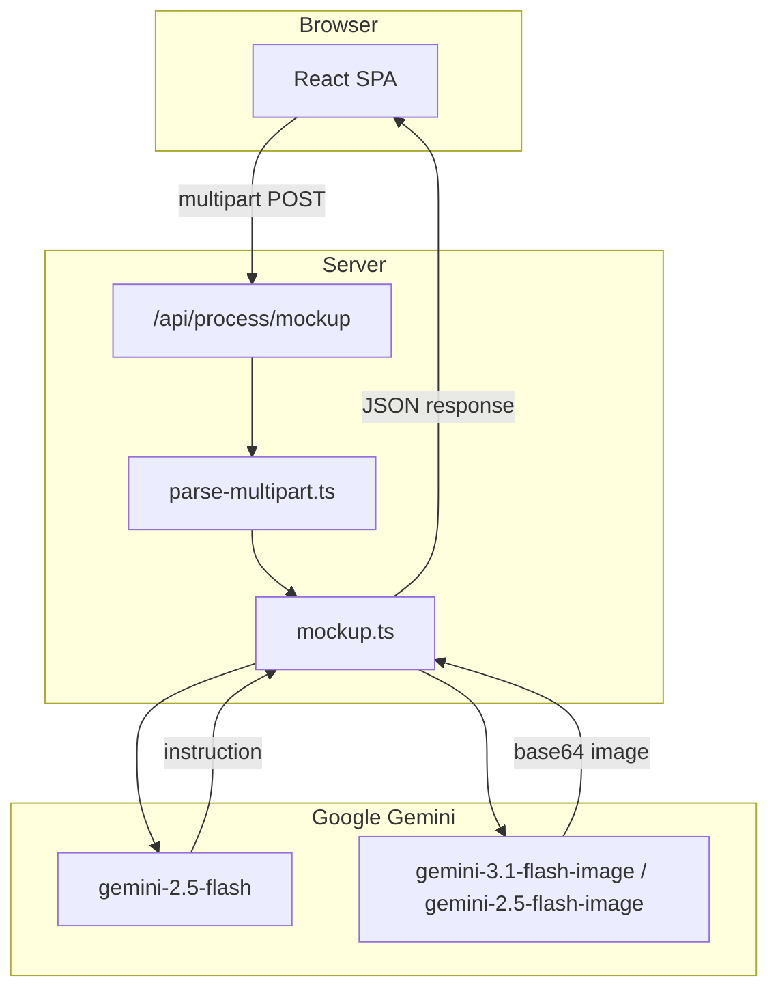

# Mockuper

**Mockuper** is a web app that replaces a placeholder product in a lifestyle mockup photo with your real product. You upload two images—a product shot and a mockup scene—and the app returns a new image where your product appears naturally in the scene, with correct perspective, lighting, and shadows.

The pipeline mirrors the workflow available on [gemini.google.com](https://gemini.google.com): first generate a detailed **Bria instruction** from both images, then pass that instruction to **Nano Banana 2** (Gemini's image generation models) to render the final mockup.

---

## Table of contents

- [What it does](#what-it-does)
- [How it works](#how-it-works)
- [Architecture](#architecture)
- [Tech stack](#tech-stack)
- [Requirements](#requirements)
- [Getting started](#getting-started)
- [Environment variables](#environment-variables)
- [API reference](#api-reference)
- [Deployment](#deployment)
- [Project structure](#project-structure)
- [Limitations](#limitations)

---

## What it does

Mockuper solves a common e-commerce and marketing problem: you have a professional lifestyle mockup (e.g. a bag on a table, a bottle in someone's hand) but it shows a generic or competitor product. You want to swap in *your* product without reshooting the entire scene.

**Inputs:**

| Input | Description |
|-------|-------------|
| **Product image** | A photo of the exact product to insert (your SKU, packaging, colors, logos). |
| **Mockup scene** | A lifestyle photo containing a product that should be replaced. |

**Output:**

| Output | Description |
|--------|-------------|
| **Generated mockup** | A new image with your product integrated into the scene. Returned as a base64 data URL. |
| **Bria instruction** | The text prompt that was generated and sent to the image model, shown for transparency and debugging. |

**User experience:**

1. Upload or drag-and-drop both images (PNG, JPG, or WebP, up to 20 MB each).
2. Click **Generate Mockup**.
3. Wait while the server runs two sequential Gemini API calls (typically 1–3 minutes).
4. View, expand, or download the result. Compare it side-by-side with the original inputs.

The frontend shows a live elapsed timer during generation and surfaces clear error messages if the API fails.

---

## How it works

Generation is a **two-step server-side pipeline**. All Gemini calls happen on the backend so the API key never reaches the browser.

### Step 1: Bria instruction (Gemini 2.5 Flash)

Both images are sent to `gemini-2.5-flash` with a structured prompt asking the model to:

- Identify the object to replace in the mockup scene.
- Describe the replacement product in exhaustive detail (shape, materials, texture, color, stitching, logos, text, hardware).
- Specify natural in-scene integration requirements (perspective, scale, lighting, shadows, hand interaction).
- Explicitly forbid cutout overlays, flat paste-ons, background removal, or leaving the original product visible.
- Preserve the background, props, and composition from the mockup.

The model returns JSON: `{"instruction": "..."}`. If parsing fails or the instruction is empty, the request errors out.

### Step 2: Nano Banana 2 (Gemini image models)

The Bria instruction plus both images are sent to Gemini's image generation models in order:

1. `gemini-3.1-flash-image` (primary)
2. `gemini-2.5-flash-image` (fallback if the primary fails)

The request uses `responseModalities: ["IMAGE"]`. The server extracts the inline image data from the response and returns it as a `data:image/...;base64,...` URL.

### Request flow (end to end)

```
Browser                         Server                              Google Gemini
   │                               │                                       │
   │  POST /api/process/mockup     │                                       │
   │  (multipart: product, mockup) │                                       │
   │──────────────────────────────>│                                       │
   │                               │  gemini-2.5-flash                     │
   │                               │  (both images → Bria instruction)     │
   │                               │──────────────────────────────────────>│
   │                               │<──────────────────────────────────────│
   │                               │  gemini-3.1-flash-image (or fallback) │
   │                               │  (both images + instruction → image)  │
   │                               │──────────────────────────────────────>│
   │                               │<──────────────────────────────────────│
   │  { image, instruction }       │                                       │
   │<──────────────────────────────│                                       │
```

Multipart uploads are parsed with [Busboy](https://github.com/mscdex/busboy). Each file field (`product`, `mockup`) is buffered in memory with a 20 MB size limit enforced during streaming.

---

## Architecture

Mockuper is a single-page React app backed by one API route. The same core logic (`lib/mockup.ts`, `lib/parse-multipart.ts`) runs in two environments:

| Environment | Frontend | API |
|-------------|----------|-----|
| **Local dev** | Vite dev middleware via Bun + Express (`server.ts`) | `POST /api/process/mockup` on Express |
| **Production (Vercel)** | Static files from `dist/` | Serverless function at `api/process/mockup.ts` |
| **Self-hosted** | Static files from `dist/` via Express | Same Express route as dev |



On Vercel, non-API routes are rewritten to `index.html` for client-side routing. The mockup function is configured with **300s max duration** and **1024 MB memory** in `vercel.json`.

---

## Tech stack

### Frontend

| Technology | Role |
|------------|------|
| **React 19** | UI components and state |
| **TypeScript** | Type safety across frontend and backend |
| **Vite 6** | Dev server, HMR, and production bundling |
| **Tailwind CSS 4** | Styling (`@tailwindcss/vite` plugin) |
| **Motion** | Modal and transition animations |
| **Lucide React** | Icons |

### Backend

| Technology | Role |
|------------|------|
| **Bun** | JavaScript runtime for local dev and production server |
| **Express 4** | HTTP server, static file serving, API route in dev/self-host |
| **Busboy** | Multipart form parsing for image uploads |
| **@google/genai** | Official Google Gemini SDK |
| **@vercel/node** | Vercel serverless function types and runtime adapter |

### Infrastructure

| Technology | Role |
|------------|------|
| **Vercel** | Recommended production hosting (static SPA + serverless API) |
| **Google Gemini API** | Text analysis (Bria instruction) and image generation (Nano Banana 2) |

---

## Requirements

### Runtime

- **[Bun](https://bun.sh)** — required for local development and the self-hosted production server (`bun run dev`, `bun run start`).

### API access

- **Google Gemini API key** — set as `GEMINI_API_KEY`. Required for all mockup generation. Obtain one from [Google AI Studio](https://aistudio.google.com/apikey).
- The key must have access to:
  - `gemini-2.5-flash` (instruction generation)
  - `gemini-3.1-flash-image` and/or `gemini-2.5-flash-image` (image generation)

### Production hosting (Vercel)

- **Vercel Pro plan** (or equivalent) is effectively required for production use. Mockup generation takes 1–3 minutes, but Vercel Hobby limits serverless functions to **10 seconds**. This project configures **300 seconds** (`maxDuration: 300`) in `vercel.json` and `api/process/mockup.ts`, which needs [Vercel Pro](https://vercel.com/docs/functions/runtimes#max-duration).
- **1024 MB function memory** is configured for the image processing workload.

### Optional

- **[Vercel CLI](https://vercel.com/docs/cli)** — for `bun run vercel:dev` to preview the Vercel routing and serverless function locally.

### Upload constraints

- Image formats: PNG, JPG, WebP (anything with an `image/*` MIME type accepted by the browser).
- Maximum file size: **20 MB** per image (enforced server-side during multipart parsing).

---

## Getting started

### 1. Clone and install

```bash
git clone <your-repo-url>
cd mockuper
bun install
```

### 2. Configure environment

```bash
cp .env.example .env
```

Edit `.env` and set your Gemini API key:

```env
GEMINI_API_KEY="your-api-key-here"
APP_URL="http://localhost:3000"
```

### 3. Run locally

```bash
bun run dev
```

Open [http://localhost:3000](http://localhost:3000). The Bun server starts Express on port 3000, mounts Vite in middleware mode for hot reload, and registers the mockup API route.

### Available scripts

| Command | Description |
|---------|-------------|
| `bun run dev` | Development server with hot reload (port 3000) |
| `bun run build` | Build the React frontend to `dist/` |
| `bun run start` | Production server: serves `dist/` + API (run `build` first) |
| `bun run vercel:dev` | Local Vercel preview (serverless function + static build) |
| `bun run lint` | Typecheck with `tsc --noEmit` |
| `bun run clean` | Remove the `dist/` directory |

---

## Environment variables

| Variable | Required | Default | Description |
|----------|----------|---------|-------------|
| `GEMINI_API_KEY` | **Yes** | — | Google Gemini API key. Used by all server-side generation calls. Never exposed to the client. |
| `APP_URL` | No | `http://localhost:3000` | Public URL of the deployed app. Used for metadata and links. Set to your Vercel domain in production. |

---

## API reference

### `POST /api/process/mockup`

Generates a product mockup from two uploaded images.

**Content-Type:** `multipart/form-data`

**Fields:**

| Field | Type | Required | Description |
|-------|------|----------|-------------|
| `product` | file | Yes | Product image to insert into the scene |
| `mockup` | file | Yes | Lifestyle mockup scene containing a product to replace |

**Success response** (`200`):

```json
{
  "image": "data:image/png;base64,...",
  "instruction": "Replace the brown leather handbag on the marble table with..."
}
```

**Error responses:**

| Status | Condition |
|--------|-----------|
| `400` | Missing `product` or `mockup` field |
| `405` | Method other than POST (Vercel handler only) |
| `500` | Gemini API failure, file too large, instruction parse error, or other server error |

Error body:

```json
{
  "error": "Human-readable error message"
}
```

---

## Deployment

### Vercel (recommended)

1. Push the repository to GitHub (or connect another Git provider).
2. Import the project at [vercel.com/new](https://vercel.com/new).
3. Vercel detects settings from `vercel.json`:
   - **Install:** `bun install`
   - **Build:** `bun run build`
   - **Output:** `dist/`
4. Add environment variables in the Vercel dashboard:
   - `GEMINI_API_KEY` (required)
   - `APP_URL` (your production URL, e.g. `https://mockuper.vercel.app`)
5. Deploy.

Ensure your Vercel plan supports the 300s function timeout configured for `api/process/mockup.ts`.

To test locally with Vercel routing:

```bash
bun run vercel:dev
```

### Self-hosted

Build and run the Bun production server:

```bash
bun run build
NODE_ENV=production bun run start
```

This serves the static frontend from `dist/` and handles `/api/process/mockup` on the same port (3000). No 10-second timeout applies—you control the server runtime.

---

## Project structure

```
mockuper/
├── api/
│   └── process/
│       └── mockup.ts       # Vercel serverless handler
├── lib/
│   ├── mockup.ts           # Bria instruction + Nano Banana pipeline
│   └── parse-multipart.ts  # Shared multipart parser (Express + Vercel)
├── src/
│   ├── App.tsx             # Main UI: uploads, generation, results
│   ├── main.tsx            # React entry point
│   ├── index.css           # Tailwind imports and global styles
│   └── types.ts            # Frontend TypeScript types
├── server.ts               # Bun + Express dev/production server
├── vite.config.ts          # Vite + React + Tailwind configuration
├── vercel.json             # Vercel build, rewrites, function config
├── metadata.json           # App metadata (name, description)
├── .env.example            # Environment variable template
└── package.json
```

**Shared logic:** `lib/mockup.ts` and `lib/parse-multipart.ts` are imported by both `server.ts` (local/self-hosted) and `api/process/mockup.ts` (Vercel), so behavior is identical across environments.

---

## Limitations

- **Generation time:** Two sequential Gemini calls typically take 1–3 minutes. The UI shows a loading state and elapsed timer; there is no streaming or partial results.
- **Vercel Hobby timeout:** The 10-second Hobby limit will cause timeouts in production unless you upgrade to Pro or self-host.
- **In-memory uploads:** Images are fully buffered in server memory (up to 20 MB each). Very large batches or concurrent requests increase memory pressure on serverless functions.
- **Model availability:** Image generation depends on Gemini model access. If `gemini-3.1-flash-image` is unavailable, the app falls back to `gemini-2.5-flash-image`; if both fail, the request returns a 500 error.
- **No persistence:** Generated images are returned inline and not stored. Refreshing the page clears the result unless the user downloads it.
- **No authentication:** The API is open to anyone who can reach the server. Add auth or rate limiting before exposing a public deployment.
