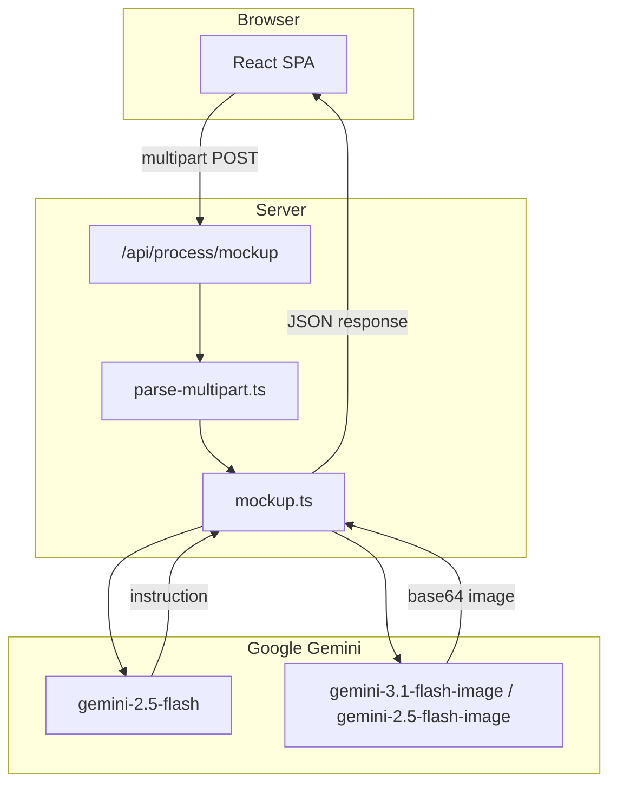

# Mockuper

**Mockuper** is a web app that replaces a placeholder product in a lifestyle mockup photo with your real product. You upload two images—a product shot and a mockup scene—and the app returns a new image where your product appears naturally in the scene, with correct perspective, lighting, and shadows.

The pipeline mirrors the workflow available on [gemini.google.com](https://gemini.google.com): first generate a detailed **Bria instruction** from both images, then pass that instruction to **Nano Banana 2** (Gemini's image generation models) to render the final mockup.

---

## Table of contents

- [What it does](#what-it-does)
- [How it works](#how-it-works)
- [Architecture](#architecture)
- [Tech stack](#tech-stack)
- [Requirements](#requirements)
- [Getting started](#getting-started)
- [Environment variables](#environment-variables)
- [API reference](#api-reference)
- [Deployment](#deployment)
- [Project structure](#project-structure)
- [Limitations](#limitations)

---

## What it does

Mockuper solves a common e-commerce and marketing problem: you have a professional lifestyle mockup (e.g. a bag on a table, a bottle in someone's hand) but it shows a generic or competitor product. You want to swap in *your* product without reshooting the entire scene.

**Inputs:**

| Input | Description |
|-------|-------------|
| **Product image** | A photo of the exact product to insert (your SKU, packaging, colors, logos). |
| **Mockup scene** | A lifestyle photo containing a product that should be replaced. |

**Output:**

| Output | Description |
|--------|-------------|
| **Generated mockup** | A new image with your product integrated into the scene. Returned as a base64 data URL. |
| **Bria instruction** | The text prompt that was generated and sent to the image model, shown for transparency and debugging. |

**User experience:**

1. Upload or drag-and-drop both images (PNG, JPG, or WebP, up to 20 MB each).
2. Click **Generate Mockup**.
3. Wait while the server runs two sequential Gemini API calls (typically 1–3 minutes).
4. View, expand, or download the result. Compare it side-by-side with the original inputs.

The frontend shows a live elapsed timer during generation and surfaces clear error messages if the API fails.

---

## How it works

Generation is a **two-step server-side pipeline**. All Gemini calls happen on the backend so the API key never reaches the browser.

### Step 1: Bria instruction (Gemini 2.5 Flash)

Both images are sent to `gemini-2.5-flash` with a structured prompt asking the model to:

- Identify the object to replace in the mockup scene.
- Describe the replacement product in exhaustive detail (shape, materials, texture, color, stitching, logos, text, hardware).
- Specify natural in-scene integration requirements (perspective, scale, lighting, shadows, hand interaction).
- Explicitly forbid cutout overlays, flat paste-ons, background removal, or leaving the original product visible.
- Preserve the background, props, and composition from the mockup.

The model returns JSON: `{"instruction": "..."}`. If parsing fails or the instruction is empty, the request errors out.

### Step 2: Nano Banana 2 (Gemini image models)

The Bria instruction plus both images are sent to Gemini's image generation models in order:

1. `gemini-3.1-flash-image` (primary)
2. `gemini-2.5-flash-image` (fallback if the primary fails)

The request uses `responseModalities: ["IMAGE"]`. The server extracts the inline image data from the response and returns it as a `data:image/...;base64,...` URL.

### Request flow (end to end)

```
Browser                         Server                              Google Gemini
   │                               │                                       │
   │  POST /api/process/mockup     │                                       │
   │  (multipart: product, mockup) │                                       │
   │──────────────────────────────>│                                       │
   │                               │  gemini-2.5-flash                     │
   │                               │  (both images → Bria instruction)     │
   │                               │──────────────────────────────────────>│
   │                               │<──────────────────────────────────────│
   │                               │  gemini-3.1-flash-image (or fallback) │
   │                               │  (both images + instruction → image)  │
   │                               │──────────────────────────────────────>│
   │                               │<──────────────────────────────────────│
   │  { image, instruction }       │                                       │
   │<──────────────────────────────│                                       │
```

Multipart uploads are parsed with the Web `FormData` API. Each file field (`product`, `mockup`) is buffered in memory with a 20 MB size limit.

---

## Architecture

Mockuper is a single-page React app served by one **Bun** process (`server.ts`). The same server handles the API, frontend assets, and hot reload in development.

| Mode | Frontend | API |
|------|----------|-----|
| **Development** (`bun run dev`) | Bun HTML bundler with HMR from `index.html` | `POST /api/process/mockup` on `Bun.serve` |
| **Production** (`bun run start`) | Static files from `dist/` (built with `bun build`) | Same route on `Bun.serve` |



Mockup generation can take 1–3 minutes, so the server must run as a long-lived process (not a short-lived serverless function).

---

## Tech stack

### Frontend

| Technology | Role |
|------------|------|
| **React 19** | UI components and state |
| **TypeScript** | Type safety across frontend and backend |
| **Biome** | Linting, formatting, and import organization |
| **Bun** | HTTP server, dev bundler/HMR, and production frontend build |
| **Tailwind CSS 4** | Styling via `@tailwindcss/cli` (scans components, outputs compiled CSS) |
| **Lucide React** | Icons |

### Backend

| Technology | Role |
|------------|------|
| **Bun** | HTTP server (`Bun.serve`), dev bundler/HMR, and runtime |
| **@google/genai** | Official Google Gemini SDK |

### Infrastructure

| Technology | Role |
|------------|------|
| **Google Gemini API** | Text analysis (Bria instruction) and image generation (Nano Banana 2) |

---

## Requirements

### Runtime

- **[Bun](https://bun.sh)** — required for development and production (`bun run dev`, `bun run start`).

### API access

- **Google Gemini API key** — set as `GEMINI_API_KEY`. Required for all mockup generation. Obtain one from [Google AI Studio](https://aistudio.google.com/apikey).
- The key must have access to:
  - `gemini-2.5-flash` (instruction generation)
  - `gemini-3.1-flash-image` and/or `gemini-2.5-flash-image` (image generation)

### Upload constraints

- Image formats: PNG, JPG, WebP (anything with an `image/*` MIME type accepted by the browser).
- Maximum file size: **20 MB** per image (enforced server-side during multipart parsing).

---

## Getting started

### 1. Clone and install

```bash
git clone <your-repo-url>
cd mockuper
bun install
```

### 2. Configure environment

```bash
cp .env.example .env
```

Edit `.env` and set your Gemini API key:

```env
GEMINI_API_KEY="your-api-key-here"
APP_URL="http://localhost:3000"
```

### 3. Run locally

```bash
bun run dev
```

Open [http://localhost:3000](http://localhost:3000). Bun serves the React app with HMR and the mockup API on port 3000.

### Available scripts

| Command | Description |
|---------|-------------|
| `bun run dev` | Dev server + Tailwind CSS watch (port 3000) |
| `bun run build` | Build the React frontend to `dist/` with Bun |
| `bun run start` | Production server: serves `dist/` + API (run `build` first) |
| `bun run lint` | Lint and format check with Biome |
| `bun run lint:fix` | Auto-fix lint issues and format with Biome |
| `bun run format` | Format all files with Biome |
| `bun run typecheck` | Typecheck with `tsc --noEmit` |
| `bun run check` | Run Biome and TypeScript checks |
| `bun run clean` | Remove the `dist/` directory |

---

## Environment variables

| Variable | Required | Default | Description |
|----------|----------|---------|-------------|
| `GEMINI_API_KEY` | **Yes** | — | Google Gemini API key. Used by all server-side generation calls. Never exposed to the client. |
| `APP_URL` | No | `http://localhost:3000` | Public URL of the deployed app. Used for metadata and links. Set to your Vercel domain in production. |

---

## API reference

### `POST /api/process/mockup`

Generates a product mockup from two uploaded images.

**Content-Type:** `multipart/form-data`

**Fields:**

| Field | Type | Required | Description |
|-------|------|----------|-------------|
| `product` | file | Yes | Product image to insert into the scene |
| `mockup` | file | Yes | Lifestyle mockup scene containing a product to replace |

**Success response** (`200`):

```json
{
  "image": "data:image/png;base64,...",
  "instruction": "Replace the brown leather handbag on the marble table with..."
}
```

**Error responses:**

| Status | Condition |
|--------|-----------|
| `400` | Missing `product` or `mockup` field |
| `405` | Method other than POST |
| `500` | Gemini API failure, file too large, instruction parse error, or other server error |

Error body:

```json
{
  "error": "Human-readable error message"
}
```

---

## Deployment

### Vercel

The repo includes `vercel.json` and `api/process/mockup.ts` so Vercel can serve the built SPA from `dist/` and run the mockup API as a Bun serverless function. `Bun.serve` in `server.ts` is for local dev and self-hosted production only.

1. Import the project in Vercel (or `bunx vercel deploy`).
2. Set **`GEMINI_API_KEY`** in the project environment variables.
3. Set **`APP_URL`** to your production URL (e.g. `https://your-app.vercel.app`).
4. Redeploy after changing env vars.

Mockup generation takes **1–3 minutes**. Configure `maxDuration: 300` in `vercel.json` (requires a **Pro** plan or higher; Hobby is capped at 10s). Set `APP_URL` in production.

### Self-hosted (Bun server)

For a single long-lived process with no serverless timeout:

```bash
bun install
bun run build
NODE_ENV=production bun run start
```

Set `GEMINI_API_KEY` (and optionally `PORT`, `APP_URL`) in the environment. The server listens on port **3000** by default.

---

## Project structure

```
mockuper/
├── lib/
│   ├── mockup.ts           # Bria instruction + Nano Banana pipeline
│   ├── parse-multipart.ts  # Multipart form parsing
│   └── handle-mockup.ts    # API route handler
├── src/
│   ├── app.tsx             # Main UI: uploads, generation, results
│   ├── main.tsx            # React entry point
│   ├── tailwind.css        # Tailwind source (@import, @theme, keyframes)
│   ├── app.css             # Generated Tailwind output (gitignored)
│   └── types.ts            # Frontend TypeScript types
├── server.ts               # Bun.serve — API + frontend (dev and production)
├── biome.json              # Biome lint and format configuration
├── metadata.json           # App metadata (name, description)
├── .env.example            # Environment variable template
└── package.json
```

---

## Limitations

- **Generation time:** Two sequential Gemini calls typically take 1–3 minutes. The UI shows a loading state and elapsed timer; there is no streaming or partial results.
- **In-memory uploads:** Images are fully buffered in server memory (up to 20 MB each). High concurrency increases memory pressure.
- **Model availability:** Image generation depends on Gemini model access. If `gemini-3.1-flash-image` is unavailable, the app falls back to `gemini-2.5-flash-image`; if both fail, the request returns a 500 error.
- **No persistence:** Generated images are returned inline and not stored. Refreshing the page clears the result unless the user downloads it.
- **No authentication:** The API is open to anyone who can reach the server. Add auth or rate limiting before exposing a public deployment.
