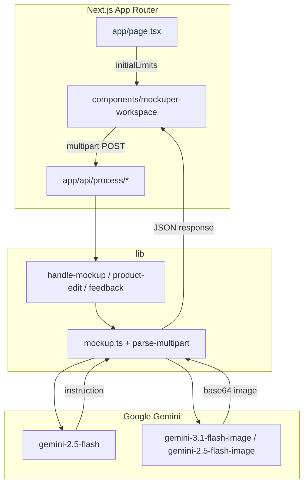

# Mockuper

**Mockuper** is a web app that replaces a placeholder product in a lifestyle mockup photo with your real product. You upload two images—a product shot and a mockup scene—and the app returns a new image where your product appears naturally in the scene, with correct perspective, lighting, and shadows.

The pipeline mirrors the workflow available on [gemini.google.com](https://gemini.google.com): first generate a detailed **Bria instruction** from both images, then pass that instruction to **Nano Banana 2** (Gemini's image generation models) to render the final mockup.

---

## Table of contents

- [What it does](#what-it-does)
- [How it works](#how-it-works)
- [Architecture](#architecture)
- [Tech stack](#tech-stack)
- [Requirements](#requirements)
- [Getting started](#getting-started)
- [Environment variables](#environment-variables)
- [Database (Neon)](#database-neon)
- [API reference](#api-reference)
- [Deployment](#deployment)
- [Project structure](#project-structure)
- [Limitations](#limitations)

---

## What it does

Mockuper solves a common e-commerce and marketing problem: you have a professional lifestyle mockup (e.g. a bag on a table, a bottle in someone's hand) but it shows a generic or competitor product. You want to swap in *your* product without reshooting the entire scene.

**Inputs:**

| Input | Description |
|-------|-------------|
| **Product image** | A photo of the exact product to insert (your SKU, packaging, colors, logos). |
| **Mockup scene** | A lifestyle photo containing a product that should be replaced. |

**Output:**

| Output | Description |
|--------|-------------|
| **Generated mockup** | A new image with your product integrated into the scene. Returned as a base64 data URL. |
| **Bria instruction** | The text prompt that was generated and sent to the image model, shown for transparency and debugging. |

**User experience:**

1. Upload or drag-and-drop both images (PNG, JPG, or WebP, up to 20 MB each).
2. Click **Generate Mockup**.
3. Wait while the server runs two sequential Gemini API calls (typically 1–3 minutes).
4. View, expand, or download the result. Compare it side-by-side with the original inputs.

The frontend shows a live elapsed timer during generation and surfaces clear error messages if the API fails.

---

## How it works

Generation is a **two-step server-side pipeline**. All Gemini calls happen on the backend so the API key never reaches the browser.

### Step 1: Bria instruction (Gemini 2.5 Flash)

Both images are sent to `gemini-2.5-flash` with a structured prompt asking the model to:

- Identify the object to replace in the mockup scene.
- Describe the replacement product in exhaustive detail (shape, materials, texture, color, stitching, logos, text, hardware).
- Specify natural in-scene integration requirements (perspective, scale, lighting, shadows, hand interaction).
- Explicitly forbid cutout overlays, flat paste-ons, background removal, or leaving the original product visible.
- Preserve the background, props, and composition from the mockup.

The model returns JSON: `{"instruction": "..."}`. If parsing fails or the instruction is empty, the request errors out.

### Step 2: Nano Banana 2 (Gemini image models)

The Bria instruction plus both images are sent to Gemini's image generation models in order:

1. `gemini-3.1-flash-image` (primary)
2. `gemini-2.5-flash-image` (fallback if the primary fails)

The request uses `responseModalities: ["IMAGE"]`. The server extracts the inline image data from the response and returns it as a `data:image/...;base64,...` URL.

### Request flow (end to end)

```
Browser                         Server                              Google Gemini
   │                               │                                       │
   │  POST /api/process/mockup     │                                       │
   │  (multipart: product, mockup) │                                       │
   │──────────────────────────────>│                                       │
   │                               │  gemini-2.5-flash                     │
   │                               │  (both images → Bria instruction)     │
   │                               │──────────────────────────────────────>│
   │                               │<──────────────────────────────────────│
   │                               │  gemini-3.1-flash-image (or fallback) │
   │                               │  (both images + instruction → image)  │
   │                               │──────────────────────────────────────>│
   │                               │<──────────────────────────────────────│
   │  { image, instruction }       │                                       │
   │<──────────────────────────────│                                       │
```

Multipart uploads are parsed with the Web `FormData` API. Each file field (`product`, `mockup`) is buffered in memory with a 20 MB size limit.

---

## Architecture

Mockuper is a **Next.js 16** App Router app. The home page is a Server Component that passes cached upload limits to a client workspace; API routes delegate to shared handlers in `lib/`.

| Layer | Role |
|-------|------|
| `app/page.tsx` | Server Component — `getUploadLimitsCached()` → `MockuperWorkspace` |
| `components/*` | Client UI — uploads, generation, results, feedback |
| `app/api/**/route.ts` | Route handlers — mockup, product-edit, limits, feedback |
| `lib/` | Gemini pipeline, multipart parsing, Neon usage logging |



Mockup generation can take 1–3 minutes. On Vercel, `maxDuration` is set on the process route handlers (see [Deployment](#deployment)).

---

## Tech stack

### Frontend

| Technology | Role |
|------------|------|
| **Next.js 16** | App Router, Server Components, Cache Components (PPR) |
| **React 19** | Client workspace components and state |
| **TypeScript** | Type safety across frontend and backend |
| **Biome** | Linting, formatting, and import organization |
| **Tailwind CSS 4** | Styling via PostCSS (`app/globals.css`) |
| **Lucide React** | Icons |

### Backend

| Technology | Role |
|------------|------|
| **Next.js Route Handlers** | `/api/*` endpoints on Node.js (Vercel Functions locally via `next dev`) |
| **@google/genai** | Official Google Gemini SDK |
| **Prisma ORM** | Type-safe access to `usage_events` (Neon via `@prisma/adapter-neon`) |
| **Sharp** | Server-side image compression before Gemini |

### Infrastructure

| Technology | Role |
|------------|------|
| **Google Gemini API** | Text analysis (Bria instruction) and image generation (Nano Banana 2) |
| **Neon Postgres** | Usage tracking (prompts, ImgBB URLs, timing, feedback) |
| **ImgBB** | Temporary public hosting for logged input/output images |

---

## Requirements

### Runtime

- **[Bun](https://bun.sh)** — package manager and script runner (`bun install`, `bun run dev`).
- **Node.js 20+** — used by Next.js under the hood for `next dev` / `next build` / `next start`.

### API access

- **Google Gemini API key** — set as `GEMINI_API_KEY`. Required for all mockup generation. Obtain one from [Google AI Studio](https://aistudio.google.com/apikey).
- The key must have access to:
  - `gemini-2.5-flash` (instruction generation)
  - `gemini-3.1-flash-image` and/or `gemini-2.5-flash-image` (image generation)

### Upload constraints

- Image formats: PNG, JPG, WebP (anything with an `image/*` MIME type accepted by the browser).
- **Self-hosted:** **20 MB** per image (default; override with `MAX_FILE_SIZE_BYTES`).
- **Vercel:** **2 MB** per image, **~4 MB** combined — Vercel rejects function request bodies over **4.5 MB** (`FUNCTION_PAYLOAD_TOO_LARGE`). The UI loads limits from `GET /api/limits`.

---

## Getting started

### 1. Clone and install

```bash
git clone <your-repo-url>
cd mockuper
bun install
```

`postinstall` runs `prisma generate` so the typed client in `lib/generated/prisma` is available before `dev` or `build`.

### 2. Configure environment

```bash
cp .env.example .env
```

Edit `.env` and set at least your Gemini API key. For usage logging (optional but recommended), also set `DATABASE_URL` and `IMGBB_API_KEY` — see [Database (Neon)](#database-neon).

```env
GEMINI_API_KEY="your-api-key-here"
APP_URL="http://localhost:3000"
DATABASE_URL="postgresql://..."
IMGBB_API_KEY="your-imgbb-key"
```

### 3. Run locally

```bash
bun run dev
```

Open [http://localhost:3000](http://localhost:3000). Next.js serves the app and API routes on port 3000.

### Available scripts

| Command | Description |
|---------|-------------|
| `bun run dev` | Next.js dev server (port 3000) |
| `bun run build` | Production build (Turbopack) |
| `bun run start` | Production server (`next start`; run `build` first) |
| `bun run lint` | Lint and format check with Biome |
| `bun run lint:fix` | Auto-fix lint issues and format with Biome |
| `bun run format` | Format all files with Biome |
| `bun run typecheck` | Typecheck with `tsc --noEmit` |
| `bun run check` | Run Biome and TypeScript checks |
| `bun run clean` | Remove the `.next/` build cache |

---

## Environment variables

| Variable | Required | Default | Description |
|----------|----------|---------|-------------|
| `GEMINI_API_KEY` | **Yes** | — | Google Gemini API key. Used by all server-side generation calls. Never exposed to the client. |
| `APP_URL` | No | `http://localhost:3000` | Public URL of the deployed app. Used for metadata and links. Set to your Vercel domain in production. |
| `DATABASE_URL` | For usage logging | — | Neon Postgres connection string. Required to persist generation runs and feedback. |
| `IMGBB_API_KEY` | For usage logging | — | [ImgBB](https://api.imgbb.com/) API key. Input/output images are uploaded here; only URLs are stored in Postgres. |

---

## Database (Neon)

Usage tracking stores one row per generation attempt in `usage_events` (ImgBB image URLs, prompts, timing, errors, and optional feedback). Apply the schema once before enabling logging in the app.

### 1. Create a Neon project

1. Sign in at [neon.tech](https://neon.tech) and create a project (or use an existing one).
2. Copy the **connection string** from the dashboard (use the pooled or direct URL your deployment needs).
3. Set `DATABASE_URL` in `.env` (local) and in Vercel project settings (production).

### 2. Run migrations (Prisma)

From the repo root, with `DATABASE_URL` set in `.env`:

```bash
bun run db:migrate
```

For local development when you change `prisma/schema.prisma`:

```bash
bun run db:migrate:dev
```

This applies migrations in [`prisma/migrations/`](prisma/migrations/). Legacy SQL under [`db/migrations/`](db/migrations/) matches the same schema and is kept for reference only.

**Existing database created from old SQL scripts?** Prisma migrate may report the table already exists. Either use a fresh Neon branch/database, or baseline once:

```bash
bunx prisma migrate resolve --applied 20250604233400_init_usage_events
```

### 3. Verify

In the SQL editor or `psql`:

```sql
SELECT column_name, data_type
FROM information_schema.columns
WHERE table_name = 'usage_events'
ORDER BY ordinal_position;
```

You should see columns for workflow metadata, ImgBB URLs (`product_image_url`, `mockup_image_url`, `reference_image_urls`, `output_image_url`), `duration_ms`, and feedback fields (`feedback_sentiment`, `feedback_comment`, `feedback_submitted_at`).

---

## API reference

### `POST /api/process/mockup`

Generates a product mockup from two uploaded images.

**Content-Type:** `multipart/form-data`

**Fields:**

| Field | Type | Required | Description |
|-------|------|----------|-------------|
| `product` | file | Yes | Product image to insert into the scene |
| `mockup` | file | Yes | Lifestyle mockup scene containing a product to replace |

**Success response** (`200`):

```json
{
  "image": "data:image/png;base64,...",
  "instruction": "Replace the brown leather handbag on the marble table with...",
  "mode": "full",
  "usageId": "550e8400-e29b-41d4-a716-446655440000"
}
```

`usageId` is a UUID for the persisted usage row when `DATABASE_URL` and `IMGBB_API_KEY` are set. It is `null` if logging failed or env vars are missing. Use it with the [feedback endpoint](#post-apiusageidfeedback) below.

**Error responses:**

| Status | Condition |
|--------|-----------|
| `400` | Missing `product` or `mockup` field (no `usageId`) |
| `405` | Method other than POST |
| `500` | Gemini API failure, file too large, instruction parse error, or other server error |

Error body (failed runs may still include `usageId` when logging succeeded):

```json
{
  "error": "Human-readable error message",
  "usageId": "550e8400-e29b-41d4-a716-446655440000"
}
```

### `POST /api/usage/:id/feedback`

Attach optional thumbs-up/down feedback to a generation run. `:id` is the `usageId` from a mockup or product-edit response.

**Content-Type:** `application/json`

**Body:**

```json
{
  "sentiment": "positive",
  "comment": "Optional free text (max 2000 characters after trim)"
}
```

| Field | Required | Values |
|-------|----------|--------|
| `sentiment` | Yes | `positive` or `negative` |
| `comment` | No | Trimmed string |

**Responses:**

| Status | Body |
|--------|------|
| `200` | `{ "ok": true }` |
| `400` | Invalid body or sentiment |
| `404` | Unknown `usageId` |
| `409` | Feedback already submitted for this run |
| `405` | Non-POST |

Requires `DATABASE_URL`. Feedback is allowed for both successful and failed runs.

---

## Deployment

### Vercel

Vercel auto-detects Next.js. No SPA `rewrites` or static `dist/` output is required.

1. Import the project in Vercel (or `bunx vercel deploy`).
2. Use **`bun install`** as the install command if prompted (or set it in project settings).
3. Set **`GEMINI_API_KEY`** in the project environment variables.
4. Set **`APP_URL`** to your production URL (e.g. `https://your-app.vercel.app`).
5. For usage logging, set **`DATABASE_URL`** and **`IMGBB_API_KEY`**, run the [migration](#2-run-the-migration), and redeploy.
6. Redeploy after changing env vars.

**Upload size on Vercel:** Each image must be **≤ 2 MB** (both together **≤ ~4 MB**). This is a platform limit, not configurable on Hobby or Pro.

Mockup generation takes **1–3 minutes**. `export const maxDuration = 60` is set on `app/api/process/mockup/route.ts` and `app/api/process/product-edit/route.ts`. Increase to `300` on a **Pro** plan if you need longer runs (Hobby is capped at 10s for serverless).

### Self-hosted

```bash
bun install
bun run build
NODE_ENV=production bun run start
```

Set `GEMINI_API_KEY` (and optionally `PORT`, `APP_URL`) in the environment. The server listens on port **3000** by default.

---

## Project structure

```
mockuper/
├── app/
│   ├── layout.tsx              # Root layout, metadata, globals.css
│   ├── page.tsx                # Server page — cached limits → workspace
│   ├── globals.css             # Tailwind 4 source
│   └── api/
│       ├── limits/route.ts
│       ├── process/mockup/route.ts
│       ├── process/product-edit/route.ts
│       └── usage/[id]/feedback/route.ts
├── components/
│   ├── mockuper-workspace.tsx  # Client orchestration
│   └── …                       # Uploads, results, feedback, UI helpers
├── lib/
│   ├── mockup.ts               # Bria instruction + Nano Banana pipeline
│   ├── parse-multipart.ts      # Multipart form parsing
│   ├── handle-mockup.ts        # Mockup route handler
│   ├── handle-product-edit.ts
│   └── upload-limits.ts        # Limits JSON for page + GET /api/limits
├── types/
│   └── index.ts                # Shared TypeScript types
├── db/
│   └── migrations/
│       └── 001_usage_events.sql
├── next.config.ts
├── postcss.config.mjs
├── biome.json
├── .env.example
└── package.json
```

---

## Limitations

- **Generation time:** Two sequential Gemini calls typically take 1–3 minutes. The UI shows a loading state and elapsed timer; there is no streaming or partial results.
- **In-memory uploads:** Images are fully buffered in server memory (up to 20 MB each). High concurrency increases memory pressure.
- **Model availability:** Image generation depends on Gemini model access. If `gemini-3.1-flash-image` is unavailable, the app falls back to `gemini-2.5-flash-image`; if both fail, the request returns a 500 error.
- **Client-side results:** Generated images are returned inline to the browser; refreshing clears the UI result unless the user downloads it. With usage logging enabled, metadata and ImgBB URLs are stored in Neon (not shown in-app).
- **No authentication:** The API is open to anyone who can reach the server. Add auth or rate limiting before exposing a public deployment.
